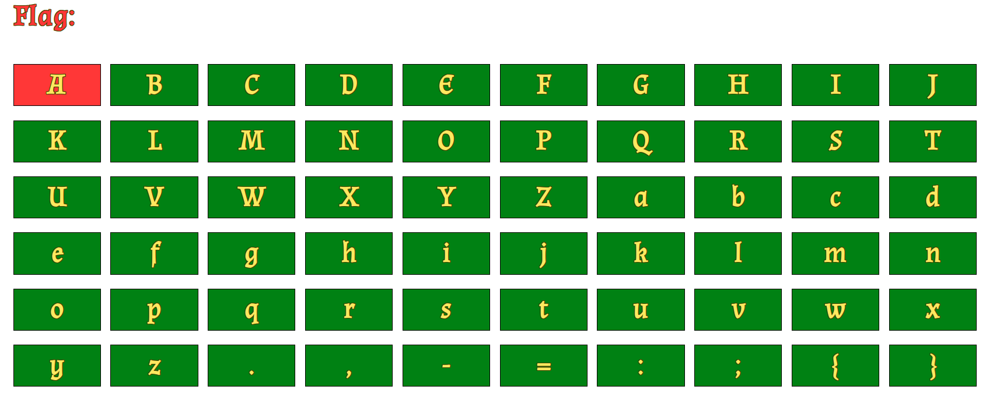
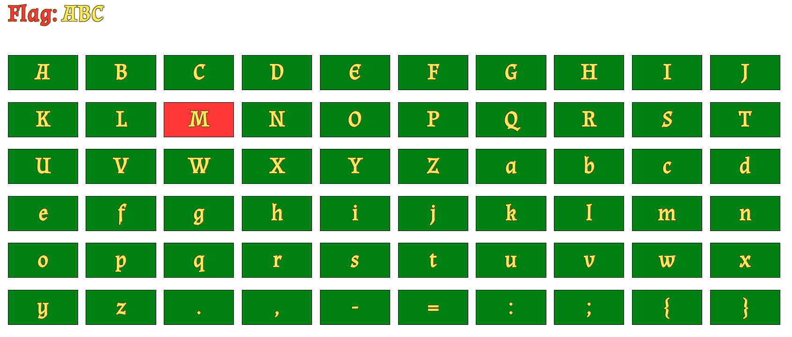
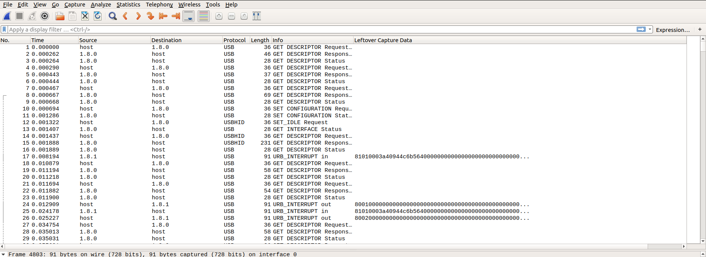
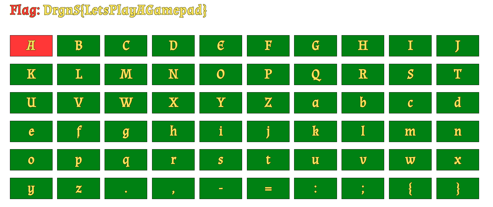

# PlayCAP

We are given 2 files:
- HTML5 application (`app.html`)
- Packet Capture file (`PlayCAP.pcapng`)

At first I started looking at app.html. When opened it presents a simple screen keyboard.   

   
By analysing given javascript I found out that the app might be controlled through an external gamepad. 
Basically you we send commands like `left`, `right`, `up` and `down` 
which will move a cursor in corresponding direction. Also `select` appends
focused character to the "Flag" field, and `reset` moves cursor into initial position.
These action are triggered using a DPAD and A/X buttons. I didn't have any gamepad to test it,
so I made sure I'm able to control the input by applying modification to the end of the script.
```javascript
  //...
  window.gamepad_poll = setInterval(function() {
    let pads = navigator.getGamepads();
    for (let i = 0; i < pads.length; i++) {
      if (pads[i] === null) {
        continue;
      }

      let pad = pads[i];
      if (pad.buttons.length < 18) {
        continue;
      }

      checkChange(pad.buttons, 'left', 14);  // Direction buttons.
      checkChange(pad.buttons, 'right', 15);
      checkChange(pad.buttons, 'up', 12);
      checkChange(pad.buttons, 'down', 13);
      checkChange(pad.buttons, 'reset', 3);  // X
      checkChange(pad.buttons, 'select', 1);  // A
    }
  }, 50);
    
    ////////////////////////////////////
    //////// MOD STARTS HERE ///////////
    ////////////////////////////////////
    
    var inputs = [
        "select",
        "right",
        "select",
        "right",
        "select",
        "down"
    ];

    for (i = 0; i < inputs.length; i++) {
        handleButtons(inputs[i], true);
    }

    ////////////////////////////////////
    //////// MOD ENDS HERE /////////////
    ////////////////////////////////////  
});
  </script>
</html>
``` 
   

   
By changing content of `inputs` variable we are able to simulate an input from gamepad.

Let's jump into analysing .pcap file.
   
I opened given .pcap file in Wireshark. It seemed to contain a USB traffic captured between game controller and a host.
   

   
I immediately realized that this sequence of packets represents a series of inputs that after applying
will type a flag in provided HTML5 application.
    
At this point I started researching USB HID protocol. These sources seemed to be useful:
- https://www.usb.org/sites/default/files/documents/hut1_12v2.pdf
- https://www.beyondlogic.org/usbnutshell/usb5.shtml

I also found a writeup for a similar challenge from the past:
- https://medium.com/@ali.bawazeeer/kaizen-ctf-2018-reverse-engineer-usb-keystrok-from-pcap-file-2412351679f4
 
I found out that the device reports VendorID=`0x057e` and ProductID=`0x2009`, 
so most probably it's a Nintendo Pro Controller. I found several projects aiming for reversing this model:
- https://github.com/shinyquagsire23/HID-Joy-Con-Whispering
- https://github.com/dekuNukem/Nintendo_Switch_Reverse_Engineering
   
Next thing I did was filtering packets that I suspected to be valuable:
```
((usb.transfer_type == 0x01) && (frame.len == 91)) && (usb.endpoint_address.direction == IN)
```
Then I exported filtered packets to `traffic.json` file (File -> Export packets dissection -> as json... -> traffic.json)
   
I wrote a small python script and started analysing the data
```python
import json

f = open('traffic.json')
root = json.load(f)
f.close()

for entry in root:
    capdata = entry['_source']['layers']['usb.capdata']
    capdata = capdata.replace(':', '').decode('hex')
    print capdata
```
```
81010003a40944c6b564000000000000000000000000000000000000000000000000000000000000000000000000000000000000000000000000000000000000
81010003a40944c6b564000000000000000000000000000000000000000000000000000000000000000000000000000000000000000000000000000000000000
81020000000000000000000000000000000000000000000000000000000000000000000000000000000000000000000000000000000000000000000000000000
81030000000000000000000000000000000000000000000000000000000000000000000000000000000000000000000000000000000000000000000000000000
81020000000000000000000000000000000000000000000000000000000000000000000000000000000000000000000000000000000000000000000000000000
30129100800078087c28a87a00000000000000000000000000000000000000000000000000000000000000000000000000000000000000000000000000000000
21149100800078f87b28b87a00803303000000000000000000000000000000000000000000000000000000000000000000000000000000000000000000000000
30169100800078087c28987a00000000000000000000000000000000000000000000000000000000000000000000000000000000000000000000000000000000
211a9100800078e87b27b87a00803000000000000000000000000000000000000000000000000000000000000000000000000000000000000000000000000000
301c9100800077087c26a87a00000000000000000000000000000000000000000000000000000000000000000000000000000000000000000000000000000000
211f9100800078f87b27a87a00804000000000000000000000000000000000000000000000000000000000000000000000000000000000000000000000000000
30229100800078087c27987a00000000000000000000000000000000000000000000000000000000000000000000000000000000000000000000000000000000
...
```

I spend a LOT of time trying to find any patterns and apply knowledge from sources mentioned above.
Unfortunately nothing seemed to work. 

Finally I stumbled upon this patch proposed for Linux kernel some time ago:
- https://patchwork.kernel.org/patch/10761581/

```c
//...
ctlr->but_y		= 0x01 & data[3];
ctlr->but_x		= 0x02 & data[3];
ctlr->but_b		= 0x04 & data[3];
ctlr->but_a		= 0x08 & data[3];
ctlr->but_sr_right_jc	= 0x10 & data[3];
ctlr->but_sl_right_jc	= 0x20 & data[3];
ctlr->but_r		= 0x40 & data[3];
ctlr->but_zr		= 0x80 & data[3];
ctlr->but_l		= 0x40 & data[5];
ctlr->but_zl		= 0x80 & data[5];
ctlr->but_minus		= 0x01 & data[4];
ctlr->but_plus		= 0x02 & data[4];
ctlr->but_rstick	= 0x04 & data[4];
ctlr->but_lstick	= 0x08 & data[4];
ctlr->but_home		= 0x10 & data[4];
ctlr->but_capture	= 0x20 & data[4];
ctlr->but_down		= 0x01 & data[5];
ctlr->but_up		= 0x02 & data[5];
ctlr->but_right		= 0x04 & data[5];
ctlr->but_left		= 0x08 & data[5];
ctlr->but_sr_left_jc	= 0x10 & data[5];
ctlr->but_sl_left_jc	= 0x20 & data[5];
// ...
```
Immediately after implementing this pattern 
I noticed that generated keystroke combinations finally started to make sense.
   
I wrote an exploit `solve.py`, and found out that combination is:
```
var inputs = [
	"down",
	"reset",
	"reset",
	"reset",
	"right",
	"right",
	"right",
	"select",
	"down",
	"down",
	"down",
	"down",
	"select",
	"up",
	"left",
	"select",
	"right",
	"right",
	"right",
	"right",
	"right",
	"right",
	"right",
	"select",
	"right",
	"right",
	"right",
	"right",
	"right",
	"up",
	"up",
	"right",
	"right",
	"right",
	"right",
	"select",
	"down",
	"down",
	"down",
	"down",
	"select",
	"up",
	"up",
	"up",
	"up",
	"left",
	"left",
	"left",
	"left",
	"left",
	"left",
	"left",
	"select",
	"down",
	"down",
	"left",
	"select",
	"right",
	"right",
	"right",
	"right",
	"right",
	"down",
	"select",
	"left",
	"select",
	"up",
	"up",
	"up",
	"right",
	"select",
	"down",
	"down",
	"right",
	"right",
	"right",
	"left",
	"select",
	"up",
	"left",
	"select",
	"down",
	"down",
	"left",
	"left",
	"left",
	"left",
	"left",
	"left",
	"down",
	"select",
	"up",
	"up",
	"up",
	"up",
	"up",
	"select",
	"right",
	"right",
	"right",
	"right",
	"right",
	"right",
	"select",
	"down",
	"down",
	"select",
	"right",
	"right",
	"down",
	"select",
	"right",
	"right",
	"select",
	"right",
	"down",
	"select",
	"up",
	"up",
	"right",
	"right",
	"right",
	"right",
	"right",
	"select",
	"right",
	"right",
	"right",
	"select",
	"down",
	"down",
	"down",
	"select",
	"reset"
];
``` 

I copied it to app.html, and retrieved the flag
   

   
`DrgnS{LetsPlayAGamepad}`
